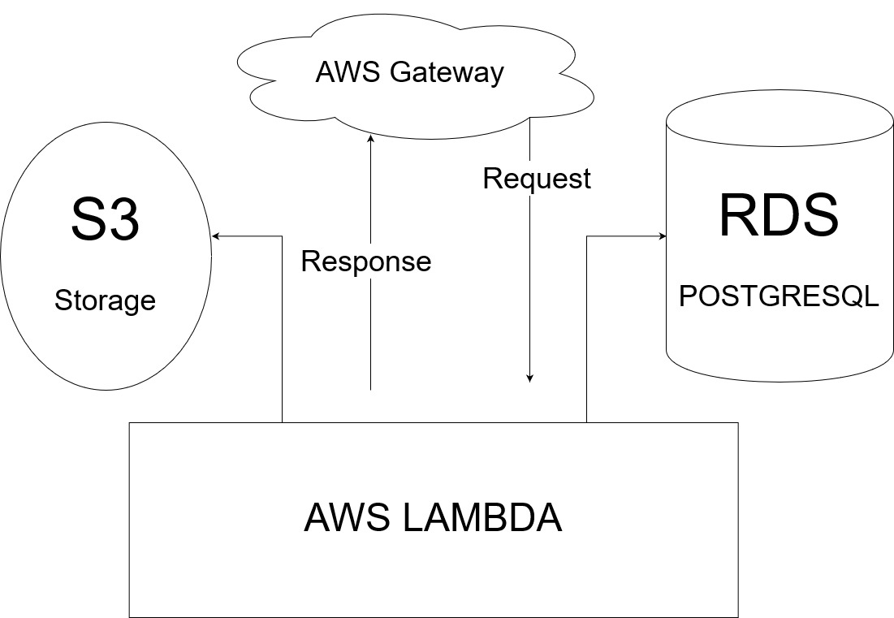

## Images Processing App
| [](https://travis-ci.com/arahmanhamdy/img-process) 	| [](https://codecov.io/gh/arahmanhamdy/img-process) 	|  [](https://www.codefactor.io/repository/github/arahmanhamdy/img-process) 	|
|-------------------------------------------------------------------------------------------------------------------------------------	|--------------------------------------------------------------------------------------------------------------------------------------------	|--------------------------------------------------------------------------------------------------------------------------------------------------------------------	|

Image Processing API written in Python using Flask API to upload images and process them. 

- [Quick Start](#Quick-Start)
    - [Using virtualenv](#using-virtualenv)
    - [Using Docker](#using-docker)
- [Configuration](#configuration)
- [Extending processors](#extending-processors)
- [Running Unit Test](#running-unit-tests)
- [CI/CD](#ci--cd)
- [AWS Live Demo](aws-live-demo)

### Quick Start
- #### Using virtualenv
    ```bash
  git clone https://github.com/arahmanhamdy/img-process.git
  cd img-process
  python -m venv .venv
  pip install -r requirements.txt
  python start.py 
    ```

- #### Using Docker
    There is a docker image on dockerhub containing the app
    ```bash
   sudo docker run -d --name myapp -p 8080:8080 arahmanhamdy/img-process
    ```

After starting the app you can test that it is up and running by curling the image history endpoint:

```bash
curl -s http://localhost:8080/images # The response should be empty list []
```

or you can start uploading images:
```bash
curl -s -F image=@<IMAGE_PATH> http://localhost:8080/images
```

### Configuration
The default configuration for the app is to run on `dev` environment, with backend `sqlite` database.
To be able to change the default behaviour you can edit the [configuration file](svc/config.py) to set new sqlalchemy url and other options.

### Extending processors
To be able to extend processors and add new image processing tasks we need the following steps:

1 - Create new python module in [processors directory](svc/processors)
```bash
touch <REPO_DIR>/svc/processors/my_task.py
```
2 - Add NAME attribute and implement `execute` function in this module
```python
# svc/processors/my_task.py
from PIL import Image


NAME = "My New Task"

def execute(img_obj):
    image = Image.open(img_obj)
    return {"width": image.width, "height": image.height}
```

3 - Explicitly add `my_task` module to processors [REGISTERED_TASKS](svc/processors/__init__.py)
```python
from svc.processors import my_task

REGISTERED_TASKS = [
    ....,
    my_task,
]
```

When we upload any image all registered tasks will be executed on the uploaded image and the results will be returned.

### Running Unit Tests
```bash
nosetests --with-coverage --cover-package=svc
```

### CI / CD
The repo is configured using [travis](https://travis-ci.com/arahmanhamdy/img-process) to run ci/cd pipeline.
The pipeline execute the following automatically with new commits:
- Run all unit tests
- Push test coverage results to [codecov.io](https://codecov.io/gh/arahmanhamdy/)
- Build new docker image and push it to [dockerhub](https://hub.docker.com/r/arahmanhamdy/img-process)
- Deploy the app to aws lambda 

### AWS live demo
I have created a live [demo](https://4dbz3odohd.execute-api.us-east-2.amazonaws.com/stg/images) using AWS free-tier with the following deployment architecture

